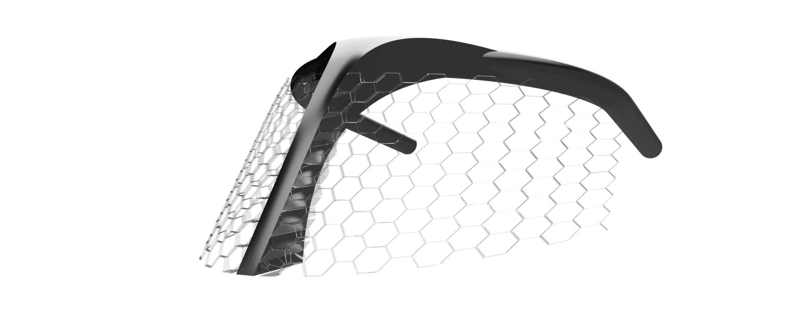
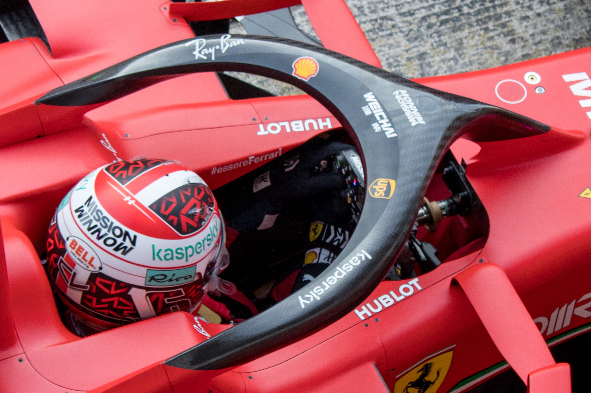
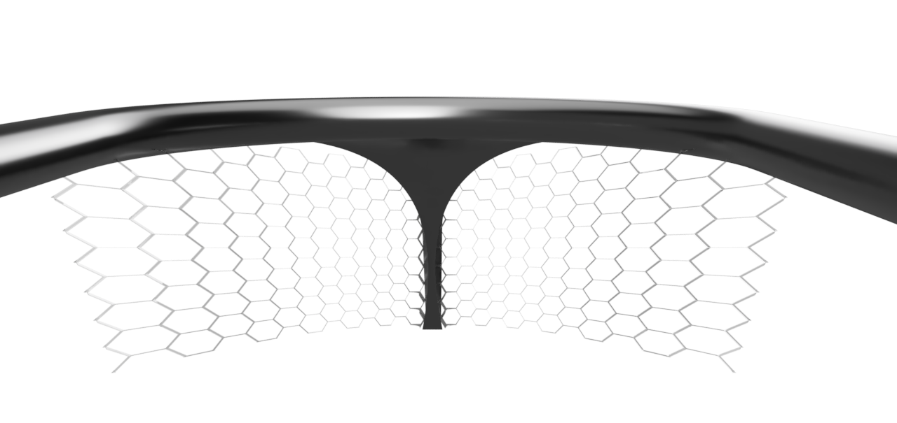
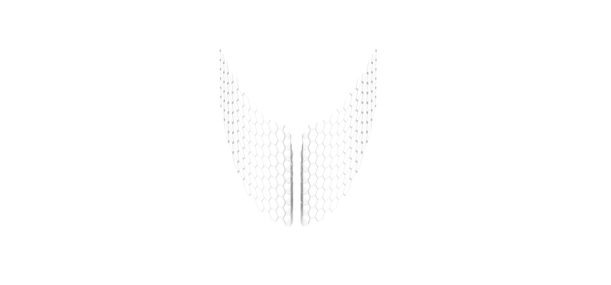

# HaloCage
A safety device that adds more protection to the existing Halo used in open-wheel racing
  
## Summary
The HaloCage is a design concept built around the existing Halo crash-protection system used in open-wheel racing series like Formula One.  
  
While the Halo itself does an excellent job of protecting the driver from being struck by larger objects, or in situations when the car is flipped over, it is not effective in shielding the driver from smaller objects and debris, which can also be very dangerous. The IndyCar series uses an aeroscreen for this reason, but remains the only series to do so. 

The HaloCage is meant to increase the level of safety that the Halo provides, while avoiding some of the tradeoffs and challenges that come with the Aeroscreen. Still in its early stages, the current design concept is a transparent 3D-printed honeycomb structure made from polycarbonate.  

The ultimate goal of this open-source project is to address and reduce some of the persistent hazards inherent to open-cockpit race cars, irrespective of the success of the HaloCage concept.
    
## Table of contents
[Summary](#summary) 
  
[Background](#background) 
&nbsp;&nbsp;[About the existing Halo](#about-the-existing-halo) 
&nbsp;&nbsp;&nbsp;&nbsp;[Key Features](#key-features) 
&nbsp;&nbsp;&nbsp;&nbsp;[Purpose](#purpose) 
&nbsp;&nbsp;&nbsp;&nbsp;[Limitations and incidents](#limitations-and-incidents) 
&nbsp;&nbsp;[About the Aeroscreen](#about-the-aeroscreen) 
&nbsp;&nbsp;&nbsp;&nbsp;[Key Features](#aero-key-features) 
&nbsp;&nbsp;&nbsp;&nbsp;[Purpose](#aero-purpose) 
&nbsp;&nbsp;[The case for the HaloCage](#the-case-for-the-HaloCage) 
  
[The HaloCage](#the-halocage) 
&nbsp;&nbsp;[Requirements](#requirements) 
&nbsp;&nbsp;[Design](#design) 
&nbsp;&nbsp;&nbsp;&nbsp;[Current state](#current-state) 
&nbsp;&nbsp;&nbsp;&nbsp;[In development](#in-development) 
&nbsp;&nbsp;[Manufacturing and material considerations](#manufacturing-and-material-considerations) 
&nbsp;&nbsp;[Testing and development](#testing-and-development) 
&nbsp;&nbsp;[Challenges, concerns, and alternatives](#challenges-concerns-and-alternatives) 
  
[Contributing](#contributing) 
[License](#license) 
[Resources](#resources) 
[Sources and credits](#sources-and-credits) 
  
## Background
### About the existing Halo
The Halo is a driver crash protection system used in open-wheel racing series, including Formula 1, Formula 2, Formula 3, Formula E, and others. It was introduced by the Fédération Internationale de l'Automobile (FIA) to enhance driver safety. The device consists of a curved bar placed above the driver's head, attached at three points to the vehicle's chassis.
  

["Halo (Formula 1)"](https://commons.wikimedia.org/wiki/File:Halo_%28Formula_1%29.jpg), by Jen Ross, licensed under [CC BY 2.5](https://creativecommons.org/licenses/by/2.5)
  
The Halo has been credited with potentially saving several drivers’ lives and protecting them from severe injury.
  
#### Key Features
* _Material_: Made from titanium, which provides a high strength-to-weight ratio.
* _Design_: The design includes a central strut in front of the driver’s helmet and two side struts, forming a protective 'halo' around the cockpit.
  
#### Purpose
* _Protects against debris_: Designed to deflect large debris and prevent it from hitting the driver's head.
* _Supports vehicle structure_: In case of a rollover, the Halo helps to protect the driver by maintaining the structural integrity of the cockpit.
  
#### Limitations and incidents
* _Partial protection_: While effective against large objects and preventing major injuries in crashes, the Halo has limitations in protecting against smaller debris or objects entering the cockpit.
* _Notable incidents_
    * In 2009, Felipe Massa was struck by a suspension spring from another car during qualifying for the Hungarian Grand Prix, resulting in serious head injuries. Although this incident occurred before the Halo's introduction, it could be argued that the large opening of the Halo might not have prevented such an incident, highlighting the potential for small objects to cause significant injuries.
    * During the 2018 Russian Grand Prix, Pierre Gasly’s visor was struck by debris from another car due to a collision ahead. Fortunately, the visor held up, but the incident underscored the limitations of the Halo in protecting drivers from smaller debris​.
  
### About the Aeroscreen
The Aeroscreen is a transparent screen which was adapted in 2019 for use in IndyCar by utilizing the Halo as a structural frame.
  
.jpg)
["2023 Indy 500 O’Ward"](https://commons.m.wikimedia.org/wiki/File:2023Indy500oward_%28cropped%29.jpg), by [350z33](https://en.wikipedia.org/wiki/User:350z33), licensed under [CC BY-SA 4.0](https://creativecommons.org/licenses/by-sa/4.0/#:~:text=https%3A//creativecommons.org/licenses/by%2Dsa/4.0/)
  
#### Key Features
* _Material_: The Aeroscreen is made from ballistic polycarbonate, providing high impact resistance and clarity.
* _Design_: It includes a wraparound screen mounted on the existing Halo structural frame, providing full frontal protection while maintaining visibility.
    
#### Purpose
* _Enhanced debris protection_: Designed to offer improved protection against smaller objects and debris, which the Halo alone might not fully deflect.
  
#### Limited use
* _Driver feedback_: Sebastian Vettel tested a similar screen called "Shield" in 2017 but reported issues with distorted and blurred vision, leading to the design being abandoned for Formula One. (Additional factors like aerodynamic effects or the weight of the device may have also contributed to its abandonment.)
* _Adoption in other series_: The Aeroscreen has been successfully implemented in IndyCar but has not yet been widely adopted in other racing series, leaving the Halo as the primary safety device in those contexts. Perhaps the need for a solution like the Aeroscreen was more pressing for IndyCar, where races often take place on high-speed oval tracks, and the risk associated with hazardous debris is arguably higher.
  
### The case for the HaloCage
It remains unclear if or when the other series will implement a solution like the Aeroscreen, but it seems that at least the Halo is here to stay foreseeable future. Hence, the HaloCage can serve as an interim solution that takes all these realities into account.
  
## The HaloCage
### Requirements
The goal of the HaloCage is to provide the highest level of protection drivers while having the least amount of impact on the car performance and the driving experience.
  
The following requirements will become more specific and quantifiable as development progresses:
  
* _Effects on visibility_
    * The HaloCage should be barely noticeable from the driver’s view.
    * Avoid any refractions, reflections, or other optical disturbances caused by the HaloCage.
    * Ideally, objects shouldn’t get stuck on the HaloCage, although this could be considered an acceptable tradeoff.
    * The visibility of the mirrors should not be impacted.
  

  
* _Effects on aerodynamics_
    * Excessive disturbances to the airflow should be avoided since this could impact the car’s performance.
    * Aerodynamic drag must be minimized.
    * Any aerodynamic forces that might cause the HaloCage to deform or come loose must be minimized or accounted for.
  
* The HaloCage should be as _lightweight_ as possible.
  
* Excessive _airflow-generated noise_ must be avoided.
  
* The HaloCage should not _get in the way_ when exiting the cockpit or removing the headrest, as is the case in F1.
  
* The HaloCage should not _become a hazard_, say if one of the sides of the HaloCage was somehow pressed in towards the cockpit due to a collision, or when sharp edges or pointy corners are created from damage.
  
* It should not negatively affect the _Halo itself_ in any way, for example:
    * If it required major design changes to the Halo
    * If it adversely affected testing or lead times for production
    * If it somehow diminished the safety that the Halo provides on its own
  
* _Manufacturability_: Producing a HaloCage should not be excessively expensive, complicated, or take too long.
  
* The HaloCage should be relatively _easy to install_ on top of the Halo.
  
* Ideally, _no fasteners or permanent bonding_ are needed and something like a set of latches would be enough to secure the HaloCage. Note: Of course, the design would need to ensure that the latches would not be affected by any impacts or forces–these would need to be transmitted through the contact areas with the Halo and the bodywork.
  
* Since the bodywork around the cockpit and below the Halo differs between cars, this might require a universal base design of the HaloCage, along with a custom portion that fills the gap between the base design and the chassis.
  
### Design
The [current conceptual design](https://a360.co/3WakMQN) is being developed in the computer-aided design software Autodesk Fusion 360. It is built around a publicly available [CAD file of the F1 Halo](https://grabcad.com/library/f1-halo-1). See the [Resources](#resources) section to download the CAD files containing the HaloCage and the Halo.
  
#### Current state
* Transparent, thin-walled honeycomb structure (less than 1mm or ~⅜”) covering most of the unprotected area susceptible to airborne objects and debris
* The depth of the walls is based on the direction of the airflow and the driver’s view: more depth towards the middle portion of the Halo, less depth towards the sides.
* The current honeycomb geometry should prevent objects that are 40mm (~1.5”) or larger from passing through.
* There are openings at the top allowing the drivers to place their hands on the Halo to help them get out of the cockpit.
  
#### In development
* Contact areas between the HaloCage, the Halo, and the car body
* Mounting mechanism for easy installation and removal
* Connecting bridge that joins both halves of the HaloCage, which are currently divided by the Halo’s strut
* Structural reinforcements along the perimeter of the HaloCage
  
### Manufacturing and material considerations
The transparent honeycomb structure could be achieved with 3d-printed polycarbonate, a lightweight and impact-resistant plastic used in applications such as bulletproof glass, astronaut helmets, and the Aeroscreen used in IndyCar.  

  
However, due to the size limitations of 3D printers, the design will likely need to be broken up into multiple interlocking sections which are subsequently fused or glued together.
  
### Testing and development
Simplified testing should suffice for the early stages to evaluate the design. Although helpful, it may not be necessary to create a replica model of the Halo; the HaloCage could initially be tested on its own to get a preliminary estimate of its structural integrity.
  
Later on, small-scale prototypes could aid in assessing its aerodynamic effects and provide more data on its impact resistance.
  
Including the 3D model in a virtual racing simulator could give an idea of how the HaloCage affects visibility inside the cockpit.
  
Simulation tools such as computational fluid dynamics could further refine the design. Any advanced testing and development such as wind tunnel work is beyond the scope of this project and would have to be done by a professional team or a governing body such as the FIA.
  
### Challenges, concerns, and alternatives  
Meeting all requirements is a difficult task. The visibility and the aesthetics of the HaloCage are a major concern and could lead to rejection among the key people who need to develop and approve it. Moreover, the full potential of other crucial attributes like the design’s structural integrity remains to be seen.
  
Despite these challenges and concerns, innovation in this area is worthwhile. Even if the HaloCage concept ultimately doesn’t succeed, hopefully it will at least give rise to new ideas or solutions that could meet the unique safety demands in open-cockpit motorsports.
  
## Contributing
At this stage, collaboration has not yet begun. However, contributors are encouraged to independently improve upon the HaloCage concept, or come up with altogether different designs. Any contributions or ideas can be shared in the Discussions section.
   
## License
This project is licensed under the MIT license, which provides maximum freedom of use. See the [LICENSE](https://github.com/c44w/HaloCage/blob/main/LICENSE) file for details.

## Resources
[HaloCage_v0.f3d](https://github.com/c44w/HaloCage/raw/main/CAD/HaloCage_v0.f3d) (CAD file for Autodesk Fusion 360)  
[HaloCage_v0.step](https://github.com/c44w/HaloCage/raw/main/CAD/HaloCage_v0.step.zip) (CAD file in universally-compatible STEP format)  
    
## Sources and credits
‘F1 Halo’ CAD file by Bhargav Gurrala on GrabCAD  
[https://grabcad.com/library/f1-halo-1](https://grabcad.com/library/f1-halo-1)
  
IndyCar Aeroscreen  
[https://www.racecar-engineering.com/articles/indycar-articles/indycar-aeroscreen/](https://www.racecar-engineering.com/articles/indycar-articles/indycar-aeroscreen/)  
[https://www.indycar.com/news/2024/04/04-16-new-aeroscreen](https://www.indycar.com/news/2024/04/04-16-new-aeroscreen)  
  
Halo safety device  
[https://en.wikipedia.org/wiki/Halo_(safety_device)](https://en.wikipedia.org/wiki/Halo_(safety_device))  
[https://www.fia.com/news/how-make-f1-halo](https://www.fia.com/news/how-make-f1-halo)
  
Felipe Massa incident (pre-Halo)  
[https://www.theguardian.com/sport/2009/jul/25/felipe-massa-fernando-alonso-hungarian](https://www.theguardian.com/sport/2009/jul/25/felipe-massa-fernando-alonso-hungarian)  
[https://www.autoblog.com/2009/07/26/felipe-massas-skull-fractured-by-track-debris-during-hungarian/](https://www.autoblog.com/2009/07/26/felipe-massas-skull-fractured-by-track-debris-during-hungarian/)
  
Pierre Gasly incident (post-Halo)  
[https://www.cnn.com/2018/10/02/motorsport/pierre-gasly-formula-one-russian-grand-prix-debris-hits-helmet-spt-intl/index.html](https://www.cnn.com/2018/10/02/motorsport/pierre-gasly-formula-one-russian-grand-prix-debris-hits-helmet-spt-intl/index.html)  
[https://www.formula1.com/en/latest/article/gasly-hails-strength-of-f1-helmet-after-debris-incident-in-russia.7GdiJZuAoMsUGUMKmGKYq0](https://www.formula1.com/en/latest/article/gasly-hails-strength-of-f1-helmet-after-debris-incident-in-russia.7GdiJZuAoMsUGUMKmGKYq0)
